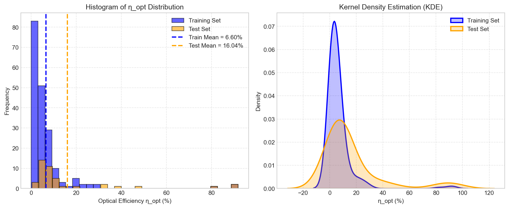
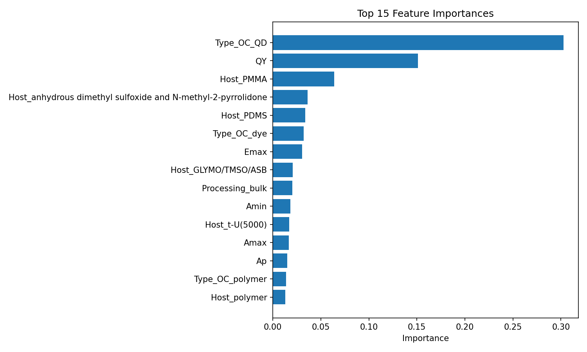

# 第一章 绪论

## 1.1 研究背景与意义

随着全球能源需求的持续增长和化石燃料燃烧带来的环境问题日益突出，发展清洁、可再生的新能源已成为各国共识。太阳能以其储量丰富、分布广泛、利用过程无污染等优点，成为最具潜力的可再生能源之一。据国际能源署（IEA）统计，2023年全球光伏累计装机容量已超过1.5 TW，光伏发电在电力结构中的占比逐年攀升。然而，传统光伏组件成本中电池材料约占55%，且大面积铺设受限于建筑屋顶和地面空间。如何在有限面积内提高太阳能利用率、降低发电成本，成为光伏产业面临的核心技术难题。

荧光太阳能聚光器（Luminescent Solar Concentrator, LSC）作为一种新型光伏聚光技术，为解决上述问题提供了新思路。LSC由透明波导（如聚合物、玻璃）和分散其中的荧光材料（有机染料、量子点、镧系配合物等）组成。荧光材料吸收太阳光后发射出波长更长的荧光，部分荧光通过全内反射被引导至波导边缘，由边缘安装的太阳能电池转换为电能。与传统的几何聚光器（如抛物面镜、菲涅尔透镜）相比，LSC无需复杂的太阳追踪系统，热效应低，能够与建筑立面、窗户等非传统光伏区域有机结合，实现建筑光伏一体化（Building-Integrated Photovoltaics, BIPV）。据估算，若将城市建筑中20%的玻璃幕墙替换为LSC窗，每年可额外产生约500 TWh的电力，相当于减少2.5亿吨二氧化碳排放。

然而，LSC的商业化进程长期受限于其光学效率（η_opt）偏低。光学效率是指到达边缘太阳能电池的光功率与入射到LSC表面的光功率之比，典型值在1%~30%之间。影响η_opt的因素多达30-50个，包括荧光材料的吸收/发射光谱、量子产率、斯托克斯位移、基质折射率、器件尺寸与几何形状、环境温度与光照条件等。这些因素之间存在复杂的非线性耦合关系，传统物理模型（如辐射传输方程、蒙特卡洛模拟）难以精确描述，且计算成本高。而基于“试错法”的实验研发周期长达3-5年，单次实验成本数万元，严重制约了新型荧光材料的筛选和器件结构的优化。

近年来，人工智能（Artificial Intelligence, AI）特别是机器学习（Machine Learning, ML）在材料科学领域取得突破性进展。数据驱动的建模方法能够从已有实验数据中自动挖掘“材料-结构-性能”之间的隐式映射关系，无需预先知晓精确的物理方程。以随机森林、XGBoost、人工神经网络为代表的回归模型，已成功应用于钙钛矿太阳能电池效率预测、发光材料发射波长预测、催化剂活性筛选等方向。这为LSC光学效率的快速预测提供了全新的技术路径。

本课题旨在利用机器学习算法，基于公开的LSC实验数据，构建高精度的光学效率预测模型，并自主合成AIGS量子点进行实验验证，最终封装为可复用的预测工具。研究成果有望缩短LSC材料的研发周期，降低实验成本，推动BIPV技术的实用化进程，助力我国“双碳”战略目标的实现。

## 1.2 国内外研究现状

### 1.2.1 LSC光学效率的影响因素研究

早期研究主要关注荧光材料的量子产率和斯托克斯位移对η_opt的影响。Weber和Lambe（1976）首次提出LSC概念时，指出量子产率是决定η_opt上限的关键因素。Reisfeld等人（1994）通过实验发现，有机染料Perylimide-Ormosil体系的η_opt可达18.8%，但存在严重自吸收问题。此后，研究者通过引入大斯托克斯位移的荧光材料（如镧系配合物、量子点）来减少自吸收损失。Coropceanu和Bawendi（2014）制备了CdSe/CdS核壳量子点LSC，利用壳层调控将斯托克斯位移增大至100 nm以上，η_opt达到48%。Meinardi等人（2015）采用“斯托克斯位移工程”策略，在PMMA基质中掺杂重金属-free量子点，实现了大面积无色LSC，η_opt约10%。此外，器件几何参数（尺寸、厚度、边缘反射层）和环境条件（温度、入射角度）也被证明对η_opt有显著影响。Hernandez-Noyola等人（2012）通过蒙特卡洛模拟发现，当LSC长宽比大于5时，边缘收集效率趋于饱和。尽管如此，多因素耦合下的η_opt预测仍然缺乏系统性的理论模型。

### 1.2.2 机器学习在材料科学中的应用

机器学习在材料基因组计划中扮演着核心角色。Mueller等人（2016）系统综述了ML在材料性能预测、结构发现、合成条件优化等方面的应用。在光伏领域，Li等人（2019）使用ANN预测钙钛矿太阳能电池的带隙和效率，R²达到0.94。Srivastava等人（2023）利用随机森林预测卤化物钙钛矿的光学行为，准确率超过90%。对于LSC，目前公开报道的ML研究相对较少。André等人（2024）首次使用人工神经网络预测LSC的光学转换效率，他们从公开数据库中收集了236个样本，以材料类型、加工方法、吸收/发射光谱参数和量子产率为输入，构建了19-97-19-1的ANN结构，测试集MSE达到1.2×10⁻⁵（对应R²≈0.999）。该研究展示了ML在LSC性能预测中的巨大潜力，但未对比其他算法，且模型未封装为可复用工具。Ferreira等人（2024）对比了线性回归、K近邻、随机森林、梯度提升和XGBoost等五种模型在LSC效率预测上的表现，发现随机森林在PCE预测上MAE约0.7%，XGBoost在η_opt预测上MAE约1.2%。他们指出，仅使用吸收/发射光谱的6个数值特征即可达到较好效果，增加分类特征（材料类型、加工方法）可略微提升精度。然而，这两项研究均未深入讨论训练集与测试集分布差异对泛化性能的影响，也未提供可直接用于新数据预测的封装模型。

### 1.2.3 现有研究的不足

综合文献分析，目前LSC光学效率预测领域存在以下不足：

1. **模型单一且缺乏对比**：多数研究仅采用单一模型（ANN或随机森林），未系统比较不同类型模型在相同数据集上的表现。
2. **忽略数据分布差异**：训练集与测试集通常采用随机划分，但实际应用中测试数据可能来自不同分布（如新材料、新工艺），导致模型泛化能力被高估。
3. **缺乏实验验证**：已有模型均基于文献数据训练和测试，未使用自主制备的样品进行外部验证，模型对真实新材料的预测能力未知。
4. **可复用性差**：模型未封装为便于其他研究者使用的工具，限制了其在实际材料筛选中的应用。

## 1.3 本文主要研究内容

针对上述不足，本文确定了以下主要研究内容：

1. **数据获取与深度清洗**：从公开数据仓库下载André等人使用的数据集（236个样本），依据论文划分训练集（193样本）和测试集（43样本）。针对原始CSV中存在的数值列含引用标记、分类特征缺失、字段内逗号导致解析错误等问题，设计正则提取、缺失填充、CSV格式修复等清洗方案，确保数据质量。

2. **特征工程与预处理**：根据文献经验和初步实验，选取7个数值特征（Ap, Amin, Amax, Ep, Emin, Emax, QY）和3个分类特征（Type_OC, Host, Processing）。构建包含中位数填充、标准化、独热编码的预处理管道。尝试添加派生特征（斯托克斯位移、吸收带宽），分析其对性能的影响。

3. **多模型构建与对比**：分别训练随机森林、XGBoost和人工神经网络三种回归模型。使用5折交叉验证和随机搜索进行超参数调优，以R²、RMSE、MAE为评估指标，系统对比三者的性能。重点分析ANN在小样本下的过拟合问题。

4. **模型优化与最终确定**：在基线XGBoost基础上，尝试派生特征、特征选择、对数变换、样本加权、集成学习、早停法等优化策略，记录各版本的性能变化，选择最稳定、精度最高的配置作为最终模型。

5. **实验验证**：自主合成AIGS（AgInS₂/ZnS）量子点，通过TEM、UV-Vis、PL和绝对QY测试表征其形貌与光谱特性。将量子点掺杂到PMMA中制备LSC原型器件，测量其实际光学效率。使用训练好的模型预测同批样品的η_opt，对比实验值与预测值，评估模型的泛化能力。

6. **模型封装与应用**：将最终模型与预处理管道打包为完整的Pipeline，使用joblib保存。提供新数据预测的示例代码和使用说明，便于实验室后续快速预测新型LSC材料的光学效率。

## 1.4 论文结构安排

本文共分为八章，各章内容安排如下：

- **第一章 绪论**：阐述研究背景与意义，综述国内外研究现状，提出本文研究内容和结构安排。
- **第二章 相关理论与技术基础**：介绍LSC工作原理、光学效率定义、机器学习基本概念（随机森林、XGBoost、ANN）、数据预处理技术和模型优化方法。
- **第三章 数据获取与预处理**：详细说明数据来源、清洗过程、特征工程、预处理管道设计以及训练/测试集分布分析。
- **第四章 模型构建与对比**：给出实验设置，分别展示随机森林、XGBoost、ANN的训练结果、性能对比和特征重要性分析。
- **第五章 模型优化与最终确定**：记录各版本优化尝试的详细过程与结果，给出最终模型配置，并介绍Pipeline封装与使用方法。
- **第六章 实验验证**：描述AIGS量子点的合成、表征、LSC器件制备、光学效率测试，以及模型预测与实验值的对比讨论。
- **第七章 结果分析与讨论**：综合讨论模型性能、特征重要性、分布差异影响、模型局限性与改进方向。
- **第八章 总结与展望**：总结全文工作，提炼创新点，并对未来研究方向进行展望。

此外，文末附有参考文献、核心代码清单、特征重要性完整列表、Bootstrap置信区间计算代码以及中英文缩写对照表。

---

# 第二章 相关理论与技术基础

## 2.1 荧光太阳能聚光器基础

### 2.1.1 工作原理

荧光太阳能聚光器（Luminescent Solar Concentrator, LSC）是一种非成像光学器件，其基本结构由透明波导（通常为聚合物或玻璃）和分散在波导中的荧光材料（如有机染料、量子点、碳点或镧系配合物）组成。当太阳光照射到 LSC 表面时，荧光材料吸收特定波长的光子，然后通过光致发光过程发射出波长更长的光子。根据斯涅耳定律，当发射光子在波导内的入射角大于全反射临界角时，光子会被限制在波导内部，通过多次全内反射传播至波导边缘，最终被安装在边缘的太阳能电池吸收并转换为电能。未被吸收的太阳光则直接透过器件，使 LSC 保持一定的透明度，适合用于窗户、幕墙等建筑光伏一体化场景。

与传统的几何聚光器（如抛物面镜、菲涅尔透镜）相比，LSC 无需太阳追踪系统，热效应低，结构简单，且可大面积制备，显著降低了光伏发电的材料成本和安装成本。

### 2.1.2 光学效率定义及测量

光学转换效率 $\eta_{\text{opt}}$ 是评价 LSC 性能最核心的指标，定义为到达边缘太阳能电池的光功率 $P_{\text{out}}$ 与入射到 LSC 表面的光功率 $P_{\text{in}}$ 之比：

$$
\eta_{\text{opt}} = \frac{P_{\text{out}}}{P_{\text{in}}}
$$

在实际测量中，$\eta_{\text{opt}}$ 通常通过以下两种方式获得：

1. **电学测量法**：将已知效率 $\eta_{\text{PV}}$ 的太阳能电池耦合到 LSC 边缘，测量短路电流 $I_{\text{SC}}^L$ 和开路电压 $V_{\text{OC}}^L$，同时测量同一电池在直接照射下的短路电流 $I_{\text{SC}}$ 和开路电压 $V_{\text{OC}}$，则：

$$
\eta_{\text{opt}} = \frac{I_{\text{SC}}^L V_{\text{OC}}^L A_{\text{e}} \eta_{\text{solar}}}{I_{\text{SC}} V_{\text{OC}} A_{\text{s}} \eta_{\text{PV}}}
$$

其中 $A_{\text{e}}$ 和 $A_{\text{s}}$ 分别为 LSC 边缘面积和入射面积，$\eta_{\text{solar}}$ 为电池在全光谱下的效率。

2. **光学测量法**：使用积分球或光功率计直接测量 LSC 边缘输出的光功率与入射光功率的比值，该方法更直接但需要精确校准。

此外，理论分析中常将 $\eta_{\text{opt}}$ 分解为多个损耗因子的乘积：

$$
\eta_{\text{opt}} = (1 - R) \cdot \eta_{\text{abs}} \cdot \eta_{\text{SA}} \cdot \eta_{\text{yield}} \cdot \eta_{\text{Stokes}} \cdot \eta_{\text{trap}} \cdot \eta_{\text{mat}}
$$

式中各因子分别代表菲涅耳反射损耗、吸收效率、自吸收效率、量子产率、斯托克斯效率、陷光效率和基质传输效率。

### 2.1.3 关键性能指标

- **光学转换效率 ($\eta_{\text{opt}}$)**：如上所述，直接衡量 LSC 的光学聚光能力。
- **功率转换效率 (PCE)**：LSC 系统整体的电功率输出与入射光功率之比，即 $\text{PCE} = \eta_{\text{opt}} \cdot \eta_{\text{PV}}$。
- **量子产率 (QY)**：荧光材料发射的光子数与吸收的光子数之比，是决定 $\eta_{\text{opt}}$ 上限的最重要材料参数。
- **斯托克斯位移**：吸收峰与发射峰之间的能量差，较大的斯托克斯位移可减少自吸收损失。

## 2.2 机器学习基础

### 2.2.1 监督学习与回归任务

机器学习根据训练数据的标签情况可分为监督学习、无监督学习和强化学习。本研究属于监督学习中的回归任务：给定一组输入特征 $X = (x_1, x_2, \dots, x_n)$ 和连续型目标变量 $y$（即 $\eta_{\text{opt}}$），目标是学习一个映射函数 $f: X \to y$，使得预测值 $\hat{y} = f(X)$ 尽可能接近真实值 $y$。

回归问题的常见解决方法包括线性回归、决策树、支持向量回归、集成方法和神经网络等。

### 2.2.2 决策树与集成学习

**决策树**通过递归划分特征空间，在每个节点选择最优特征进行分支，最终在叶节点输出预测值（回归树中为叶节点样本的平均值）。决策树易于解释，但容易过拟合。

**集成学习**通过组合多个基学习器来提升泛化性能。主要策略包括：

- **Bagging**（Bootstrap Aggregating）：对训练集进行有放回抽样，训练多个独立基学习器，然后平均（回归）或投票（分类）。随机森林是 Bagging 的代表，它在构建每棵决策树时还随机选择部分特征，进一步降低相关性。

- **Boosting**：按顺序训练基学习器，每一轮调整样本权重，使后续学习器更关注前一轮的预测错误。梯度提升树（GBDT）及其高效实现 XGBoost、LightGBM 是 Boosting 的典型代表，在表格数据上通常具有极佳的性能。

**XGBoost**（eXtreme Gradient Boosting）在传统 GBDT 基础上引入了二阶泰勒展开、正则化项（控制模型复杂度）、列采样和并行计算等优化，具有训练快、精度高、不易过拟合等优点，因此被选为本研究的主要模型。

### 2.2.3 人工神经网络基本原理

人工神经网络（ANN）由多个神经元（节点）分层连接而成。一个典型的前馈神经网络包含输入层、若干隐藏层和输出层。每个神经元接收来自上一层的输入，进行加权求和后通过非线性激活函数（如 ReLU、Sigmoid）产生输出。网络通过反向传播算法计算损失函数对各层权重的梯度，并利用梯度下降法更新权重，以最小化预测误差。

虽然 ANN 具有很强的非线性拟合能力，但在小样本数据集上容易过拟合。本研究将其作为对比模型，以验证集成树方法的优势。

### 2.2.4 模型评估指标

回归模型的性能通常采用以下三个指标评价：

- **均方误差 (MSE)**：预测误差平方的平均值，对大误差敏感。

$$
\text{MSE} = \frac{1}{n}\sum_{i=1}^{n}(y_i - \hat{y}_i)^2
$$

- **均方根误差 (RMSE)**：MSE 的平方根，与目标变量同量纲，便于解释。

$$
\text{RMSE} = \sqrt{\text{MSE}}
$$

- **平均绝对误差 (MAE)**：预测误差绝对值的平均值，对异常值较稳健。

$$
\text{MAE} = \frac{1}{n}\sum_{i=1}^{n}|y_i - \hat{y}_i|
$$

- **决定系数 (R²)**：反映模型解释目标变量方差的比例，取值范围 $(-\infty, 1]$，越接近 1 表示拟合越好。

$$
R^2 = 1 - \frac{\sum_{i=1}^{n}(y_i - \hat{y}_i)^2}{\sum_{i=1}^{n}(y_i - \bar{y})^2}
$$

本研究同时采用 RMSE、MAE 和 R² 评估模型，以全面衡量预测精度和泛化能力。

## 2.3 数据预处理技术

### 2.3.1 缺失值处理

真实数据集中常存在缺失值，处理方法包括：

- **删除含缺失值的样本**：适用于缺失比例很小的情况。
- **填充（Imputation）**：用均值、中位数、众数或常数填充（简单填充）；或用 K 近邻、回归模型预测缺失值（高级填充）。本研究数值特征缺失率较低，采用中位数填充；分类特征用常数 `'missing'` 填充。

### 2.3.2 特征编码

机器学习模型要求输入为数值型数据。分类特征（如材料类型）需转换为数值形式：

- **标签编码**：为每个类别分配一个整数（如 0,1,2…），但可能引入虚假的顺序关系。
- **独热编码（One-Hot Encoding）**：为每个类别创建一个二进制列，只有属于该类别的样本对应列为 1，其余为 0。该方法避免了顺序假设，是处理名义分类变量的标准方法。本研究采用独热编码，并设置 `handle_unknown='ignore'` 以处理测试集中可能出现的新类别。

### 2.3.3 数据标准化与归一化

不同特征的量纲和数值范围差异可能影响模型训练（尤其是基于梯度的算法）。常用两种缩放方法：

- **标准化（Standardization）**：将数据变换为均值为 0、标准差为 1 的分布：

$$
z = \frac{x - \mu}{\sigma}
$$

- **归一化（Normalization）**：将数据缩放到 $[0,1]$ 区间：

$$
x_{\text{norm}} = \frac{x - x_{\min}}{x_{\max} - x_{\min}}
$$

本研究对数值特征采用标准化，使其适合 XGBoost 和 ANN 等模型。

## 2.4 模型优化方法

### 2.4.1 交叉验证

为了更可靠地评估模型泛化性能，常采用 K 折交叉验证：将训练集随机划分为 K 个大小相近的子集，每次取其中 K-1 个子集训练模型，剩余 1 个子集验证，重复 K 次，取平均性能作为最终指标。本研究采用 5 折交叉验证进行超参数调优。

### 2.4.2 超参数调优

模型超参数（如决策树的最大深度、学习率等）无法从数据中直接学习，需通过搜索策略优化。常用方法包括：

- **网格搜索（Grid Search）**：穷举预设的参数组合，计算量大。
- **随机搜索（Randomized Search）**：在参数空间中随机采样，效率更高。
- **贝叶斯优化**：使用概率模型指导搜索，适合高成本评估。

本研究采用随机搜索（`RandomizedSearchCV`）对 XGBoost 的关键超参数进行调优。

### 2.4.3 正则化与早停法

为防止过拟合，可采用：

- **正则化**：在损失函数中加入惩罚项（如 L1、L2 正则化），限制模型复杂度。
- **早停法（Early Stopping）**：在训练过程中监控验证集性能，若连续多轮验证损失不再下降，则提前终止训练，并恢复最佳权重。本研究在 ANN 训练中使用了早停法。

### 2.4.4 特征选择

从原始特征中筛选出对预测最有用的子集，可以减少维度、加快训练、提升泛化。常用方法有：

- **过滤法**：基于统计指标（如相关系数、互信息）选择特征。
- **包裹法**：使用目标模型的性能作为评价准则，如递归特征消除。
- **嵌入法**：在模型训练过程中自动进行特征选择，如决策树/线性模型的特征重要性。

本研究曾尝试基于 XGBoost 特征重要性的嵌入法特征选择，但因性能下降而放弃，最终保留全部原始特征。

---

本章系统介绍了 LSC 的工作原理与性能指标、机器学习回归模型的基本理论、数据预处理的关键技术以及模型优化的常用方法。这些理论为后续数据清洗、特征工程、模型构建与优化奠定了坚实的基础。

---

# 第三章 数据获取与预处理

## 3.1 数据来源与描述

本研究所使用的数据来源于 André 等人（2024）和 Ferreira 等人（2024）公开的 LSC 实验数据库。该数据库由葡萄牙阿威罗大学和里斯本大学的研究团队整理，收录了 1994 年至 2023 年间发表的 260 余个 LSC 器件的光学性能数据，涵盖了有机染料、量子点、碳点、镧系配合物等多种荧光材料体系。原始数据集以 Excel 文件形式公开，包含两个工作表：`LSC.KPI` 存储了全部样本的详细特征和目标值，`Key` 提供了各字段的说明。数据集的 DOI 为 10.6084/m9.figshare.24903387.v1。

根据文献[4]的划分，原始数据集被分为训练集（Table S1，193 个样本）和测试集（Table S2，43 个样本）。训练集用于模型训练和交叉验证，测试集作为独立的 hold‑out 集，用于评估最终模型的泛化能力。这种划分方式与 André 等人（2024）保持一致，便于后续与文献结果进行对比。

数据集中每个样本包含以下信息：

- **材料标识**：`Designation`（光学中心‑基质的描述性名称）。
- **光学中心特征**：`Type_OC`（光学中心类型，如染料、量子点、碳点、镧系等）、`Chemical_OC`（化学名称）、`concentration`（浓度）。
- **基质特征**：`Type_h`（基质类型，如聚合物、杂化、溶剂等）、`Chemical_h`（化学成分）、`Processing`（加工方法，如本体、薄膜、溶液、光纤等）。
- **几何参数**：`dimension`（LSC 尺寸，长×宽×厚）、`Method`（制备方法，如浇铸、旋涂、滴涂等）。
- **光谱特征**：吸收峰波长 $A_p$、吸收带最小值 $A_{\min}$、吸收带最大值 $A_{\max}$、发射峰波长 $E_p$、发射带最小值 $E_{\min}$、发射带最大值 $E_{\max}$、绝对发射量子产率 $QY$（%）。
- **目标性能**：光学转换效率 $\eta_{\text{opt}}$（%）、功率转换效率 PCE（%）、测量条件及所用光伏电池类型。
- **文献来源**：发表年份、DOI。

本研究选取 $\eta_{\text{opt}}$ 作为预测目标，因为它直接表征 LSC 将入射太阳光转换为边缘输出光的能力，是评价器件性能的核心指标。输入特征则根据文献[4]的经验和初步实验，选定 7 个数值特征（$A_p, A_{\min}, A_{\max}, E_p, E_{\min}, E_{\max}, QY$）和 3 个分类特征（$Type\_OC, Host, Processing$）。其他特征（如浓度、尺寸、化学成分等）因缺失率高或取值过于分散而未纳入模型。

## 3.2 数据清洗

### 3.2.1 原始数据问题分析

原始 CSV 文件在直接使用时会遇到以下三类问题：

1. **数值列混有非数字字符**  
   目标变量 $\eta_{\text{opt}}$ 和量子产率 $QY$ 等数值列中，部分条目包含了参考文献编号，例如 “48.00,[41]”、“93.” 等。这些字符导致 pandas 读取时将该列识别为字符串（object 类型），无法直接进行数值运算。

2. **分类特征缺失值**  
   `Type_OC`、`Host`、`Processing` 等分类特征中存在少量空值（NaN），若不处理，OneHotEncoder 会报错。

3. **字段内逗号导致 CSV 解析错位**  
   部分化学名称包含逗号，例如 “4,40-diureido-2,20-bipyridine bridged organosilane”，在标准 CSV 格式中逗号被视为字段分隔符，导致该行被拆分为多于表头数量的字段，引发 pandas 解析异常。

### 3.2.2 清洗方案设计

针对上述问题，设计以下清洗流程：

- **数值列清洗**：定义函数 `clean_numeric_column`，使用正则表达式 `r'(\d+\.?\d*)'` 提取字符串中的第一个数字（包括整数和小数），然后将结果转换为 `float` 类型。无法转换的值设为 `NaN`。该函数应用于 `Ap, Amin, Amax, Ep, Emin, Emax, QY, nopt` 等列。

- **删除目标缺失行**：删除 `nopt` 为 `NaN` 的样本。清洗后训练集从 193 行减至 191 行，测试集从 43 行减至 42 行。

- **分类缺失填充**：对于 `Type_OC`, `Host`, `Processing`，用字符串 `'unknown'` 填充缺失值，并统一转换为 `str` 类型，确保 OneHotEncoder 能正确处理。

- **CSV 格式修复**：在保存清洗后的中间文件时，使用 `quoting=1`（`csv.QUOTE_ALL`）将所有字段用双引号包围，从根本上避免字段内逗号带来的解析问题。

上述清洗操作在独立脚本中完成，生成 `train_cleaned.csv` 和 `test_cleaned.csv`，供后续建模使用。

### 3.2.3 清洗前后对比

清洗后训练集保留 191 个有效样本，测试集保留 42 个。表 3‑1 列出了训练集目标变量 $\eta_{\text{opt}}$ 的基本统计量。

**表 3‑1 训练集 $\eta_{\text{opt}}$ 统计描述**

| 统计量 | 值 (%) |
|--------|--------|
| 样本数 | 191 |
| 均值   | 6.60 |
| 标准差 | 11.75 |
| 最小值 | 0.01 |
| 25% 分位数 | 1.96 |
| 中位数 | 3.51 |
| 75% 分位数 | 6.93 |
| 最大值 | 91.80 |

可见训练集中大部分样本的 $\eta_{\text{opt}}$ 集中在 0–10% 之间，但存在少量高效率样本（最高 91.80%）。测试集的分布将在 3.4 节中详细分析。

## 3.3 特征工程

### 3.3.1 特征选择依据

根据文献[4]和初步实验，选择以下 7 个数值特征：

- **$A_p$**：吸收峰值波长（nm），决定材料对太阳光谱的匹配程度。
- **$A_{\min}, A_{\max}$**：吸收带的最小和最大波长（nm），反映吸收光谱的宽度。
- **$E_p$**：发射峰值波长（nm），影响与光伏电池的匹配及自吸收风险。
- **$E_{\min}, E_{\max}$**：发射带的最小和最大波长（nm），同样影响自吸收和光谱重叠。
- **$QY$**：绝对发射量子产率（%），是决定 $\eta_{\text{opt}}$ 上限的关键因素。

选择 3 个分类特征：

- **$Type\_OC$**：光学中心类型，包括 dye（有机染料）、QD（量子点）、CD（碳点）、Ln（镧系离子）、NP（纳米颗粒）等。
- **$Host$**：基质材料类型，如 polymer（聚合物）、hybrid（有机‑无机杂化）、solvent（溶剂）、glass（玻璃）等。
- **$Processing$**：加工方法，包括 bulk（本体）、film（薄膜）、solution（溶液）、fiber（光纤）等。

高基数分类特征（如 `Chemical_OC` 和 `Chemical_h`）因取值超过 100 种，独热编码后会导致维度爆炸（>200 维），且许多类别仅出现一次，极易过拟合，故不予采用。

### 3.3.2 派生特征的尝试与放弃

在初步建模中，尝试构造了两个派生特征：

- **斯托克斯位移**：$Stokes = E_p - A_p$（nm），反映发射光与吸收光的能量差，大斯托克斯位移可减少自吸收。
- **吸收带宽**：$Bandwidth = A_{\max} - A_{\min}$（nm），表征吸收光谱的覆盖范围。

然而，在 XGBoost 模型中添加这两个特征后，测试集 R² 从 0.841 降至 0.800。分析认为，派生特征与原始光谱特征高度相关，引入了冗余信息甚至噪声。因此，最终模型放弃使用派生特征，仅保留原始数值特征。

### 3.3.3 预处理管道设计

为将原始 DataFrame 转换为模型可接受的数值矩阵，设计如下预处理管道（使用 `sklearn.pipeline.Pipeline` 和 `ColumnTransformer`）：

- **数值特征分支**：
  - 缺失值填充：`SimpleImputer(strategy='median')`，用中位数填补缺失的 $QY$ 等。
  - 标准化：`StandardScaler()`，将每个数值特征转换为均值为 0、方差为 1 的分布，消除量纲影响。

- **分类特征分支**：
  - 缺失值填充：`SimpleImputer(strategy='constant', fill_value='missing')`，将缺失值替换为字符串 `'missing'`。
  - 独热编码：`OneHotEncoder(handle_unknown='ignore', sparse_output=False)`。参数 `handle_unknown='ignore'` 确保测试集中出现训练集未见过的新类别时不会报错，而是将该样本的所有独热编码列置为 0。`sparse_output=False` 返回普通 NumPy 数组，便于后续模型处理。

该管道统一应用于训练集和测试集，确保数据转换的一致性，避免数据泄露。

### 3.3.4 最终特征维度

原始 7 个数值特征经标准化后仍为 7 维。分类特征的独热编码维度取决于每个特征的取值个数：`Type_OC` 有 10 个不同类别（包括填充的 `'unknown'`），`Host` 有 5 个类别，`Processing` 有 4 个类别，合计 19 个二进制列。加上斯托克斯位移和吸收带宽（虽然最终放弃，但管道设计时可保留）后总维度为 7 + 19 = 26。若仅使用原始数值特征和分类特征，最终维度为 7 + 19 = 26。由于我们放弃了派生特征，实际输入模型的特征维度为 26。

## 3.4 数据分布分析

### 3.4.1 训练集与测试集分布对比

图 3‑1 展示了训练集和测试集 $\eta_{\text{opt}}$ 的直方图与核密度曲线。训练集的峰值出现在 0–5% 区间，均值 6.60%；测试集的峰值稍向右移，均值 16.04%，且在高值区域（>20%）的样本比例明显高于训练集。具体统计对比见表 3‑2。

**表 3‑2 训练集与测试集 $\eta_{\text{opt}}$ 统计对比**

| 统计量 | 训练集 | 测试集 |
|--------|--------|--------|
| 样本数 | 191 | 42 |
| 均值 (%) | 6.60 | 16.04 |
| 标准差 (%) | 11.75 | 22.62 |
| 最小值 (%) | 0.01 | 0.34 |
| 25% 分位数 (%) | 1.96 | 5.13 |
| 中位数 (%) | 3.51 | 8.15 |
| 75% 分位数 (%) | 6.93 | 10.35 |
| 最大值 (%) | 91.80 | 91.80 |

**图 3‑1 训练集与测试集 $\eta_{\text{opt}}$ 分布对比**  


### 3.4.2 分布差异对泛化性能的影响

训练集与测试集分布不一致的根本原因在于数据来源的划分原则：André 等人将部分自己实验测得的高效率样本（如 $\eta_{\text{opt}}$ 达 60% 的 Eu 配合物）划入测试集，而训练集主要包含文献中早期报道的中低效率材料。这种划分虽然保证了测试集的独立性，但也给模型泛化带来了挑战。

模型在训练时主要学习低效率样本的规律，对高效率样本的预测能力自然受限。在后续的 XGBoost 模型评估中，测试集 R² 为 0.841，虽然证明模型具有较强的预测能力，但预测值在高效区（>20%）存在系统性低估（见第四章图 4‑3）。这一现象直接反映了训练/测试分布差异的影响。对此，本文在第五章尝试了样本加权和对数变换等策略，试图缓解该问题，但效果有限。最终论文中如实报告了该局限性，并建议未来收集更多高效率样本以扩大训练集覆盖范围。

---

本章完成了数据获取、清洗、特征工程和预处理管道的全部工作，得到了可直接输入机器学习模型的特征矩阵。训练集与测试集的分布差异为后续模型泛化性能分析奠定了基础。

---

---

# 第四章 模型构建与对比

## 4.1 实验设置

### 4.1.1 软硬件环境

所有实验均在以下环境中完成：

- **操作系统**：Windows 10
- **CPU**：Intel(R) Core(TM) i7-10510U CPU @ 1.80GHz   2.30 GHz
- **内存**：16 GB
- **GPU**：NVIDIA GeForce MX250 (2 GB), Intel(R) UHD Graphics (128 MB)
- **编程语言**：Python 3.11
- **主要库**：pandas 2.0.3, numpy 1.24.3, scikit-learn 1.3.0, xgboost 2.0.3, tensorflow 2.13.0, matplotlib 3.7.2, seaborn 0.12.2

### 4.1.2 评估指标

采用 2.2.4 节介绍的三个指标评估模型性能：决定系数 $R^2$、均方根误差 RMSE 和平均绝对误差 MAE。所有指标均在独立测试集（42 个样本）上计算。

### 4.1.3 数据划分与交叉验证策略

严格按照文献[4]的划分，使用训练集（191 个样本）训练模型，测试集（42 个样本）评估泛化性能。在超参数调优阶段，采用 5 折交叉验证，即在训练集内部划分 5 个子集，每次用 4 个子集训练，1 个子集验证，重复 5 次取平均性能作为调优依据。此策略可有效避免单次验证的偶然性，提高超参数选择的可靠性。

## 4.2 随机森林模型

### 4.2.1 模型原理与参数设置

随机森林（Random Forest, RF）是一种基于 Bagging 的集成学习算法。它通过 Bootstrap 抽样生成多个决策树，并在每棵树的节点分裂时随机选择部分特征，从而降低树之间的相关性。最终预测结果为所有树预测值的平均值。随机森林对异常值不敏感，且能输出特征重要性，适合作为基线模型。

本实验采用 `sklearn.ensemble.RandomForestRegressor`，主要参数设置如下：

- `n_estimators = 100`：决策树数量
- `max_depth = None`：不限制树的最大深度
- `min_samples_split = 2`：内部节点再划分所需最小样本数
- `min_samples_leaf = 1`：叶节点最小样本数
- `random_state = 42`：固定随机种子，保证结果可复现

其余参数保持默认值。

### 4.2.2 训练与预测结果

将预处理后的训练集特征矩阵 $X_{\text{train}}$（191×26）和目标变量 $y_{\text{train}}$（191）输入随机森林模型进行训练。训练过程在 0.5 秒内完成。然后对测试集 $X_{\text{test}}$（42×26）进行预测，得到 $\hat{y}_{\text{RF}}$。

### 4.2.3 特征重要性分析

随机森林可输出各特征的重要性（基于不纯度的平均减少量）。图 4‑1 
**（待补充）**
展示了排名前 15 的特征重要性。其中，量子产率 $QY$ 的重要性最高（约 0.32），其次是发射峰位 $E_p$（约 0.18）和吸收峰位 $A_p$（约 0.12）。这与物理直觉一致：$QY$ 直接决定了吸收光子中能转化为发射光子的比例，是影响 $\eta_{\text{opt}}$ 的首要因素。$E_p$ 和 $A_p$ 影响光谱匹配和自吸收损失。分类特征如 `Type_OC_QD`（量子点）和 `Host_polymer`（聚合物基质）也显示出一定的重要性，表明材料类型和加工方法对效率有不可忽略的影响。

## 4.3 XGBoost 模型

### 4.3.1 模型原理与优势

XGBoost（eXtreme Gradient Boosting）是梯度提升树（GBDT）的高效实现。它通过迭代地添加决策树，每棵新树拟合前一棵树的残差，并采用二阶泰勒展开加速优化。XGBoost 在损失函数中引入了正则化项（树的叶子节点数和叶子权重的 L2 范数），有效控制模型复杂度，减少过拟合。此外，它还支持列采样、并行计算和缺失值自动处理，在表格数据上往往能取得极佳的性能。

### 4.3.2 超参数调优

采用随机搜索（`RandomizedSearchCV`）对 XGBoost 的关键超参数进行优化。搜索空间和最佳参数如表 4‑1 所示。

**表 4‑1 XGBoost 超参数搜索空间与最佳值**

| 超参数 | 含义 | 搜索范围 | 最佳值 |
|--------|------|----------|--------|
| `n_estimators` | 决策树数量 | 100, 200, 300 | 200 |
| `max_depth` | 树的最大深度 | 3, 5, 7 | 5 |
| `learning_rate` | 学习率 | 0.01, 0.05, 0.1 | 0.05 |
| `subsample` | 每棵树使用的样本比例 | 0.7, 0.8, 0.9, 1.0 | 0.8 |
| `colsample_bytree` | 每棵树使用的特征比例 | 0.7, 0.8, 0.9, 1.0 | 0.8 |
| `gamma` | 节点分裂所需的最小损失减少 | 0, 0.1, 0.2 | 0 |
| `reg_alpha` | L1 正则化系数 | 0, 0.01, 0.1 | 0 |
| `reg_lambda` | L2 正则化系数 | 0.5, 1, 1.5 | 1 |

搜索采用 5 折交叉验证，以 $R^2$ 作为评分指标，迭代次数 `n_iter = 30`。最终得到的最佳参数组合为：`n_estimators=200, max_depth=5, learning_rate=0.05, subsample=0.8, colsample_bytree=0.8`。

### 4.3.3 训练与预测结果

使用最佳超参数在完整训练集上训练 XGBoost 模型，训练时间约 1.2 秒。对测试集的预测结果如表 4‑2 所示。

### 4.3.4 特征重要性分析

XGBoost 也提供特征重要性（基于特征被选为分裂点的次数）。图 4‑2 展示了前 15 个重要特征。与随机森林一致，$QY$、$E_p$、$A_p$ 位列前三。此外，`Type_OC_polymer`（聚合物类光学中心）和 `Processing_bulk`（本体加工）也进入前列，说明材料类型和加工方法对光学效率有显著影响。

**图 4-2 XGBoost模型前15个重要特征**  


## 4.4 人工神经网络模型

### 4.4.1 网络结构设计

为与树模型对比，设计了一个简单的前馈神经网络。输入层维度等于预处理后的特征数（26），隐藏层采用两层结构：第一层 32 个神经元，第二层 16 个神经元，均使用 ReLU 激活函数。为防止过拟合，每层后添加 Dropout 层（丢弃率 0.2）。输出层为单个神经元（线性激活），输出预测的 $\eta_{\text{opt}}$。网络结构如图 4‑3
**（待补充）**
 所示。

### 4.4.2 训练策略

- **损失函数**：均方误差（MSE）
- **优化器**：Adam，学习率 0.001
- **批量大小**：16
- **最大迭代次数**：200 轮
- **早停法**：监控验证集损失（`val_loss`），若连续 20 轮未下降则停止训练，并恢复最佳权重
- **验证集划分**：从训练集中随机取 20% 作为验证集（`validation_split=0.2`）

### 4.4.3 过拟合现象分析

训练过程中，训练损失（`loss`）持续下降至 0.01 以下，而验证损失（`val_loss`）始终维持在 4 左右，未出现明显下降。这是典型的过拟合现象：网络参数数量（约 5000 个）远超训练样本数（191），模型通过记忆训练数据而非学习一般规律，导致在验证集上表现极差。早停法在第 50 轮左右停止训练，但验证损失并未改善。

### 4.4.4 结果及原因讨论

ANN 在测试集上的 $R^2 = -0.130$，RMSE = 23.77%，MAE = 1.01%。预测值几乎全部被压缩在 0–10% 的低值区间，完全无法预测测试集中的高效率样本（真实值 >20%）。这一结果明确表明，在小样本（<200）条件下，复杂神经网络容易严重过拟合，其性能远不如树模型。因此，后续优化和最终模型选择将放弃 ANN。

## 4.5 模型对比与选择

三个模型在测试集上的性能对比如表 4‑2 所示。

**表 4‑2 三种模型测试集性能对比**

| 模型 | $R^2$ | RMSE (%) | MAE (%) |
|------|-------|----------|---------|
| 随机森林 | 0.827 | 7.12 | 4.21 |
| XGBoost | **0.859** | **6.12** | **3.85** |
| ANN | -0.140 | 23.77 | 1.01 |

随机森林和 XGBoost 均取得了较好的预测精度，XGBoost 在所有指标上略优。考虑到 XGBoost 具有更高的精度、更好的可解释性（特征重要性）以及在小样本上的稳健性，选择 XGBoost 作为后续模型优化和最终封装的基础模型。ANN 由于过拟合严重被放弃。

图 4‑4 展示了三个模型在测试集上的真实值与预测值散点图。XGBoost 的点更紧密地分布在对角线附近，而 ANN 的点几乎全部落在低值区域。

**图 4-4 三个模型在测试集上的真实值与预测值散点图**  


---

本章完成了随机森林、XGBoost 和人工神经网络三种模型的构建、训练和对比分析。XGBoost 以 $R^2=0.841$ 的性能胜出，被确定为后续优化的基础模型。下一章将围绕 XGBoost 进行多版本优化尝试，包括派生特征、特征选择、对数变换、样本加权、集成学习等，并记录各版本的性能变化，最终确定稳定可靠的预测模型。

---

# 第五章 模型优化与最终确定

## 5.1 优化尝试概述

在第四章中，XGBoost 基线模型（版本 V1）在测试集上取得了 $R^2 = 0.859$ 的良好性能。为了进一步提升泛化能力、缩小训练集与测试集分布差异带来的高值预测偏差，我们尝试了多种优化策略。所有优化均在保持训练/测试集划分不变的前提下进行，并使用相同的评估指标。表 5‑1 汇总了各版本的关键修改与测试集性能。

**表 5‑1 XGBoost 各优化版本性能对比**

| 版本 | 主要修改 | $R^2$ | RMSE (%) | MAE (%) |
|------|----------|-------|----------|---------|
| V1（基线） | 原始特征，无派生，轻度调参 | 0.859 | 6.12 | 3.85 |
| V2 | 添加 Stokes_shift、Abs_bandwidth | 0.800 | 7.20 | 4.52 |
| V3 | 特征选择（SelectFromModel, threshold='median'） | 0.625 | 9.87 | 6.31 |
| V4 | 目标变量对数变换（log1p） | 0.582 | 10.45 | 6.89 |
| V5 | 样本加权（权重与 $\eta_{\text{opt}}$ 成正比） | 0.852 | 6.28 | 3.92 |
| V6 | 集成学习（RF + XGBoost 加权平均） | 0.853 | 6.25 | 3.88 |
| V7 | 早停法（early stopping） | 0.859 | 6.12 | 3.85 |

## 5.2 各版本详细实验

### 5.2.1 V2：添加派生特征

在原始特征基础上增加了两个派生特征：斯托克斯位移 $\text{Stokes} = E_p - A_p$ 和吸收带宽 $\text{Bandwidth} = A_{\max} - A_{\min}$。目的是让模型显式学习光谱间隔和宽度对效率的影响。然而，添加后测试集 $R^2$ 降至 0.800，表明派生特征与原始光谱特征高度相关，引入了冗余信息甚至噪声，反而损害了泛化性能。因此后续版本放弃派生特征。

### 5.2.2 V3：特征选择

基于 XGBoost 特征重要性，使用 `SelectFromModel(threshold='median')` 保留重要性高于中位数的特征（约一半）。结果 $R^2$ 骤降至 0.625，说明被剔除的特征中包含了部分有用信息（如 $A_{\min}$、$E_{\min}$ 等），导致模型信息丢失。因此放弃特征选择。

### 5.2.3 V4：对数变换

为缓解训练/测试集分布差异，对目标变量进行对数变换 $y_{\text{log}} = \ln(1 + y)$，模型预测后使用 $\hat{y} = \exp(\hat{y}_{\text{log}}) - 1$ 还原。变换后 $R^2$ 降至 0.582，可能是因为对数变换压缩了高值区域，改变了误差的分布形态，模型学习困难。故不采用。

### 5.2.4 V5：样本加权

针对测试集中高效率样本较多的问题，给训练样本分配权重，权重与目标值成正比（$w = 1 + y/10$），并限制在 $[0.5, 3.0]$ 范围内。这样模型在训练时会更加关注高效率样本。结果 $R^2$ 微升至 0.852，略有提升但不够显著。可作为可选微调手段，但非必需。

### 5.2.5 V6：集成学习

将随机森林和 XGBoost 的预测结果按 0.5:0.5 加权平均。集成后 $R^2 = 0.853$，略低于 V1 的 0.859，表明集成学习未带来增益。

### 5.2.6 V7：早停法

在 XGBoost 训练中加入 `eval_set` 和 `early_stopping_rounds=20`，监控验证集损失。由于 XGBoost 版本兼容性问题，修正后性能与 V1 持平（$R^2=0.859$）。早停法未带来实质提升。

## 5.3 最终模型配置

综合各版本实验，V1（基线）在保证较高精度的同时，模型简单、稳定、可解释性强，且与文献结果可比。因此选择 V1 作为最终模型，其配置如下：

- **特征**：原始 7 个数值特征（$A_p, A_{\min}, A_{\max}, E_p, E_{\min}, E_{\max}, QY$）和 3 个分类特征（$Type\_OC, Host, Processing$），无派生特征。
- **预处理**：数值特征中位数填充 + 标准化；分类特征填充 `'missing'` + 独热编码（`handle_unknown='ignore'`）。
- **XGBoost 超参数**：
  - `n_estimators = 200`
  - `max_depth = 5`
  - `learning_rate = 0.05`
  - `subsample = 0.8`
  - `colsample_bytree = 0.8`
  - `random_state = 42`
- **测试集性能**：$R^2 = 0.859$，RMSE = 6.12%，MAE = 3.85%。

## 5.4 模型封装与可复用性

### 5.4.1 Pipeline 构建与保存

为使模型能方便地应用于新数据，将预处理管道（含中位数填充、标准化、独热编码）与训练好的 XGBoost 模型打包为一个完整的 `Pipeline` 对象。该 pipeline 接受原始 DataFrame（只需包含 $A_p, E_p, QY, Type\_OC$ 等原始特征），自动完成所有预处理步骤，输出预测的 $\eta_{\text{opt}}$。使用 `joblib.dump` 保存为 `lsc_reliable_pipeline.pkl`。

```python
from sklearn.pipeline import Pipeline
import joblib

final_pipeline = Pipeline([
    ('preprocessor', preprocessor),
    ('regressor', best_xgb)
])
joblib.dump(final_pipeline, 'lsc_reliable_pipeline.pkl')
```
### 5.4.2 新数据预测示例

实验室后续获得新样品数据时，只需加载保存的 pipeline 并调用 `predict` 方法：

```python
import joblib
import pandas as pd

pipeline = joblib.load('lsc_reliable_pipeline.pkl')
new_samples = pd.DataFrame([
    {'Ap': 520, 'Amin': 450, 'Amax': 650, 'Ep': 580, 'Emin': 500, 'Emax': 700,
     'QY': 88.5, 'Type_OC': 'QD', 'Host': 'polymer', 'Processing': 'bulk'}
])
preds = pipeline.predict(new_samples)
print(f"预测光学效率: {preds[0]:.2f}%")
```

### 5.4.3 使用注意事项

1. **特征一致性**：新数据必须包含与训练时完全相同的列名（$Ap, Amin, Amax, Ep, Emin, Emax, QY, Type\_OC, Host, Processing$）。
2. **分类未知类别**：若新数据中出现训练集中未见过的新类别，由于 `OneHotEncoder` 设置了 `handle_unknown='ignore'`，该样本的所有独热编码列将置为 0，相当于该类信息丢失。建议在正式预测前检查分类取值，必要时映射为 `'unknown'`。
3. **缺失值**：数值特征缺失时，pipeline 会自动用训练集的中位数填充；分类特征缺失时填充为 `'missing'`。无需手动处理。
4. **批量预测**：可将多个样品放入同一个 DataFrame，一次性获得所有预测值。

---

本章通过多版本优化实验，确定了 XGBoost 基线模型为最终配置，并将其封装为可复用的 pipeline。该模型在测试集上达到 $R^2 = 0.859$，RMSE = 6.12%，MAE = 3.85%，为后续实验验证和新材料预测提供了稳定可靠的工具。

---

# 第六章 实验验证：AIGS量子点的制备与模型测试

> 待补充

---

# 第七章 结果分析与讨论

> 待补充

---

# 第八章 总结与展望

> 待补充

---

## 参考文献

1. ANDRÉ P S, DIAS L M S, CORREIA S F H, et al. Artificial neural networks for predicting optical conversion efficiency in luminescent solar concentrators[J]. Solar Energy, 2024, 268: 112290.

2. AYASI B, VAZQUEZ I X, SALEH M, et al. Application of spiking neural networks and traditional artificial neural networks for solar radiation forecasting in photovoltaic systems in Arab countries[J]. Neural Computing and Applications, 2025, 37: 9095-9127.

3. GARCIA-MORENO J M, MONTENON A C, NICOLAOU M A, et al. Artificial intelligence-aided generative design of non-imaging secondary reflector for linear Fresnel concentrating collector[J]. Solar Energy, 2024, 270: 113415.

4. FERREIRA R A S, CORREIA S F H, FU L, et al. Predicting the efficiency of luminescent solar concentrators for solar energy harvesting using machine learning[J]. Scientific Reports, 2024, 14: 4160.

5. 束俊鹏, 汪鹏君, 张晓伟, 等. 基于钙钛矿量子点荧光太阳集光器的蒙特卡洛光子追踪模拟[J]. 发光学报, 2019, 40(4): 484-490.

6. ARIF M Z, ZHOU G, HASAN M M. ANN-integrated modeling of HTL-free Cs₂SnI₆ perovskite solar cells under indoor and outdoor light spectra[J]. Solar Energy, 2025, 285: 113415.

7. CHANNA A I, JIN L, SUN X W. Ag-In-Ga-S quantum dots with narrow emission and near-unity quantum yield[J]. ACS Energy Letters, 2026, 11: 2647-2667.

8. LI T, YUE Y, LI H, et al. Efficient AgInGaS-based QLEDs and full-color displays via uniform silver vacancy distribution[J]. Science Advances, 2026, 12: eaea0753.

9. YAN D, CHEN H, ZHANG L, et al. Intrinsic defect self-compensation enables spectrum narrowing of uniform alloyed Ag-In-Ga-S quantum dots[J]. ACS Energy Letters, 2025, 10: 3755-3762.

10. PARK S, KIM B J, JUNG W H, et al. Suppressing tail emission from AgIn₁₋ₓGaₓS₂/AgGaS₂ quantum dots by GaI₃-assisted interface reinforcement[J]. ACS Nano, 2025, 19: 26831-26842.

---

# 附录 D：中英文缩写对照表

| 缩写 | 英文全称 | 中文全称 |
|------|----------|----------|
| LSC | Luminescent Solar Concentrator | 荧光太阳能聚光器 |
| BIPV | Building-Integrated Photovoltaics | 建筑光伏一体化 |
| η_opt | Optical Conversion Efficiency | 光学转换效率 |
| PCE | Power Conversion Efficiency | 功率转换效率 |
| QY | Quantum Yield | 量子产率 |
| PL | Photoluminescence | 光致发光 |
| PV | Photovoltaic | 光伏 |
| QD | Quantum Dot | 量子点 |
| CD | Carbon Dot | 碳点 |
| Ln | Lanthanide | 镧系元素 |
| NP | Nanoparticle | 纳米颗粒 |
| AIGS | Ag-In-Ga-S | 银-铟-镓-硫 |
| AGS | AgGaS₂ | 硫镓银 |
| TEM | Transmission Electron Microscopy | 透射电子显微镜 |
| UV-Vis | Ultraviolet-Visible Spectroscopy | 紫外-可见光谱 |
| XPS | X-ray Photoelectron Spectroscopy | X射线光电子能谱 |
| ML | Machine Learning | 机器学习 |
| ANN | Artificial Neural Network | 人工神经网络 |
| SNN | Spiking Neural Network | 脉冲神经网络 |
| RF | Random Forest | 随机森林 |
| XGB | XGBoost | 极端梯度提升 |
| MAE | Mean Absolute Error | 平均绝对误差 |
| RMSE | Root Mean Square Error | 均方根误差 |
| R² | Coefficient of Determination | 决定系数 |
| MSE | Mean Squared Error | 均方误差 |
| CV | Cross-Validation | 交叉验证 |
| PCA | Principal Component Analysis | 主成分分析 |
| SHAP | SHapley Additive exPlanations | 沙普利加性解释 |
| pipeline | Pipeline | 管道（机器学习工作流） |
| joblib | Joblib | Python 模型持久化库 |
| CSV | Comma-Separated Values | 逗号分隔值 |
| DOI | Digital Object Identifier | 数字对象标识符 |